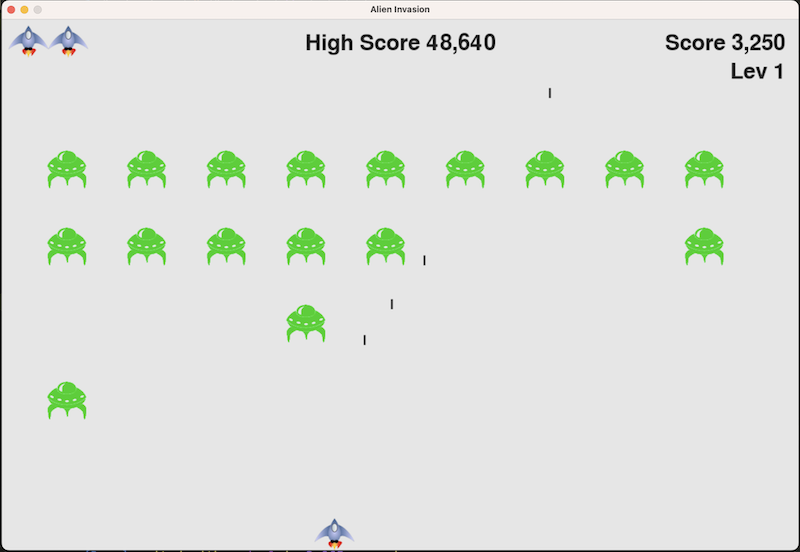
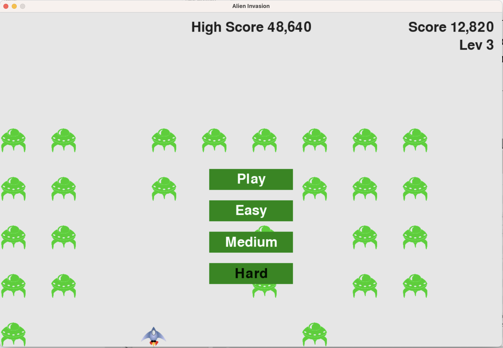

# Alien Invasion

A fun game development project in Python, OOP paradigm, during a short New Year's vacation between french classes.

It was a good opportunity to review once again all major Python concepts by coding and solving challenges, while reading “Python crash course : a hands-on, project-based introduction to programming”  by Eric Matthes.

## Project description.

The Alien Invasion project uses the Pygame package to develop a 2D arcade game. The goal of the game is to shoot down a fleet of aliens as they drop down the screen, in levels that increase in speed and difficulty.

Use arrow keys to move the ship left-right, Space - fire a bullet, P - play (or mouse), Q - quit.

## Deployment instructions.

1) Download and install Python 3 from python.org, 
2) Install pygame library (type just 'python' on Windows instead of 'python3' for Linux/Mac):
>python3 -m pip isntall pygame
3) Clone the game’s repo:
> git clone https://github.com/lugres/alien_invasion.git

OR just download all files into similar folder strcuture, if you don't have git.

4) cd into the game folder, run the game:
> pyhton3 alien_invasion.py

That’s it!

Details will follow.

## Gameplay looks like this

